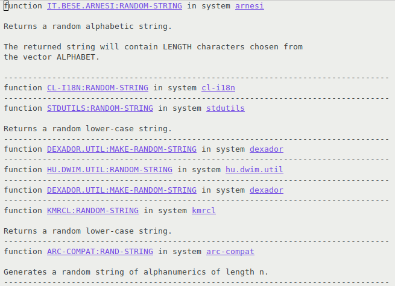

# quicklisp-apropos

Apropos across Quicklisp libraries.

Example of `apropos-function` with the query: "random string":



## Install

### Install dependencies

```lisp
(ql:quickload '(:dexador :chipz :archive :montezuma :string-case))
```

### REPL access

This library does not require Emacs and SLIME. You can simply load it and evaluat apropos functions from a REPL.

Just load `quicklisp-apropos.lisp`. Then evaluate the `apropos` functions in `quicklisp-apropos` package from a Lisp listener.

### SLIME extension

The SLIME extension displays apropos results in Emacs buffers from which you can directly navigate to the matching definitons.

ℹ️ Please consider using [SLIME :star:](https://github.com/mmontone/slime-star), that comes with this extension preinstalled.

Load `swank` and add this repository path to `swank::*load-path*`, in your Lisp compiler init file (~/.sbclrc if using SBCL):

```lisp
(require :swank)
(push #p"/home/marian/src/lisp/quicklisp-apropos/" swank::*load-path*)
```

In Emacs, add this repository path to `load-path` and add `quicklisp-apropos` to `slime-contribs` in `~/.emacs` init file, like:

```
(push "/home/marian/src/lisp/quicklisp-apropos" load-path)

(setq slime-contribs '(slime-fancy quicklisp-apropos))

(slime-setup)
```

## Use

### quicklisp-apropos package functions

* `APROPOS`
  Function: Perform apropos QUERY across libraries in Quicklisp.
* `APROPOS-CLASS`
  Function: Perform apropos QUERY to match exported CLOS classes of Quicklisp libraries.
* `APROPOS-DOC`
  Function: Perform apropos QUERY to match in documentation of exported definitions of Quicklisp libraries.
* `APROPOS-FUNCTION`
  Function: Perform apropos QUERY to match exported functions of Quicklisp libraries.
* `APROPOS-GENERIC-FUNCTION`
  Function: Perform apropos QUERY to match exported CLOS generic functions of Quicklisp libraries.
* `APROPOS-MACRO`
  Function: Perform apropos QUERY to match exported macros of Quicklisp libraries.
* `APROPOS-NAME`
  Function: Perform apropos QUERY to match exported names of Quicklisp libraries.
* `APROPOS-PACKAGE`
  Function: Perform apropos QUERY on packages of Quicklisp libraries.
* `APROPOS-SYSTEM`
  Function: Perform apropos QUERY on ASDF systems of Quicklisp libraries.
* `APROPOS-VARIABLE`
  Function: Perform apropos QUERY to match exported variables of Quicklisp libraries.

### Emacs commands

* `quicklisp-apropos`
   Apropos quicklisp using a generic QUERY.
* `quicklisp-apropos-class`
   Search across CLOS classes exported in Quicklisp libraries that
   match the QUERY.
* `quicklisp-apropos-function`
   Search across Lisp functions exported in Quicklisp libraries that
   match the QUERY.
* `quicklisp-apropos-generic-function`
   Search across CLOS generic functions exported in Quicklisp
   libraries that match the QUERY.
* `quicklisp-apropos-macro`
   Search across Lisp macros exported in Quicklisp libraries that
   match the QUERY.
* `quicklisp-apropos-package`
   Search across Lisp packages in Quicklisp libraries that match the
   QUERY.
* `quicklisp-apropos-system`
   Search across ASDF systems in Quicklisp libraries that match the
   QUERY.
* `quicklisp-apropos-variable`
   Search across Lisp variables exported in Quicklisp libraries that
   match the QUERY.
* `quicklisp-apropos-update-index`
   Download and update quicklisp-apropos index.
   
## How it works

A [Montezuma](https://github.com/sharplispers/montezuma) index is downloaded from the internet. 
Montezuma is a text search engine library for Common Lisp.
The downloaded index contains information about definitions exported by all Quicklisp libraries.
Apropos functions perform Montezuma queries over that index and displays the results.
